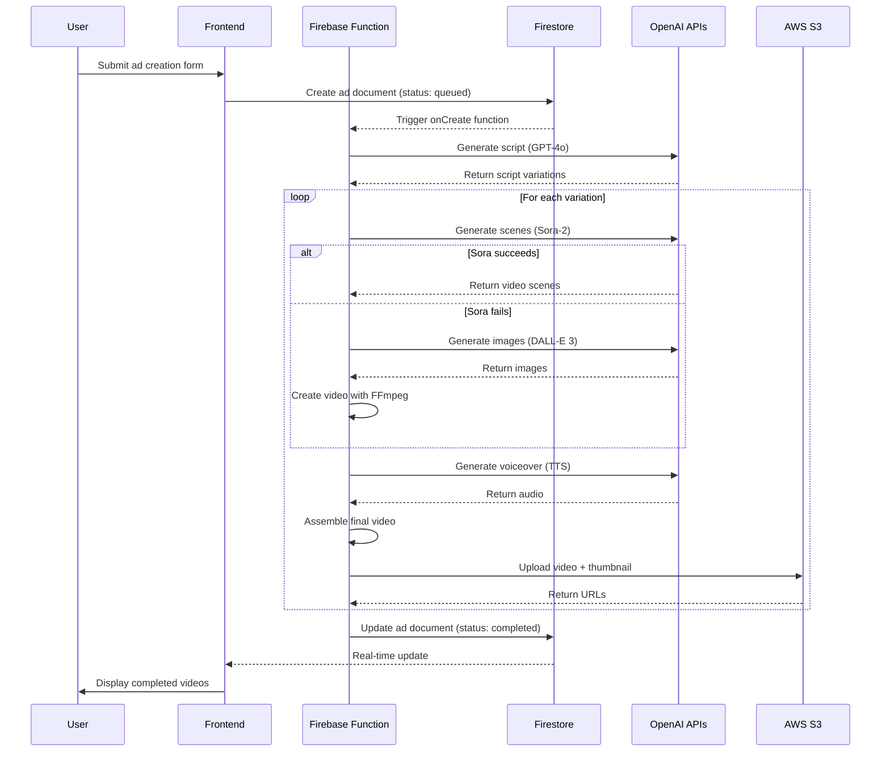

# Technical Architecture Document
## AI-Powered Dynamic Video Ad Generator

### Table of Contents
1. [System Overview](#system-overview)
2. [Technology Stack](#technology-stack)
3. [Architecture Patterns](#architecture-patterns)
4. [Component Architecture](#component-architecture)
5. [Data Flow](#data-flow)
6. [Security Architecture](#security-architecture)
7. [Infrastructure](#infrastructure)
8. [Scalability Considerations](#scalability-considerations)

---

## System Overview

The AI-Powered Dynamic Video Ad Generator is a serverless web application that leverages AI services to generate professional video advertisements from text descriptions. The system follows a microservices architecture pattern using Firebase Functions for backend processing and Next.js for the frontend.

### High-Level Architecture

```
┌─────────────────────────────────────────────────────────────┐
│                     CLIENT LAYER                            │
│  Next.js 14 App Router (TypeScript + Tailwind CSS)         │
│  - Server Components for initial load                       │
│  - Client Components for interactivity                      │
│  - Real-time updates via Firestore listeners              │
└────────────────┬────────────────────────────────────────────┘
                 │ HTTPS
                 ↓
┌─────────────────────────────────────────────────────────────┐
│                    BACKEND SERVICES                         │
├─────────────────────────────────────────────────────────────┤
│  Firebase Services:                                         │
│  - Authentication (Email/Password)                          │
│  - Firestore (NoSQL Database)                              │
│  - Cloud Functions (Serverless Compute)                    │
│  - Hosting (CDN + SSR)                                     │
└────────────────┬────────────────────────────────────────────┘
                 │
                 ↓
┌─────────────────────────────────────────────────────────────┐
│                    AI SERVICES                              │
│  OpenAI APIs:                                              │
│  - GPT-4o (Script Generation)                              │
│  - Sora-2/Pro (Video Generation)                           │
│  - DALL-E 3 (Image Generation - Fallback)                  │
│  - TTS (Text-to-Speech)                                    │
└────────────────┬────────────────────────────────────────────┘
                 │
                 ↓
┌─────────────────────────────────────────────────────────────┐
│                    STORAGE LAYER                            │
│  AWS S3:                                                    │
│  - Video file storage                                       │
│  - Thumbnail storage                                        │
│  - Asset storage (logos, images)                           │
│  - CloudFront CDN (optional)                               │
└─────────────────────────────────────────────────────────────┘
```

---

## Technology Stack

### Frontend
- **Framework**: Next.js 14 with App Router
- **Language**: TypeScript 5.0+
- **Styling**: Tailwind CSS 3.3+
- **UI Components**: Radix UI / Shadcn
- **State Management**: React Context + Zustand
- **Form Handling**: React Hook Form + Zod
- **Real-time Updates**: Firestore SDK

### Backend
- **Runtime**: Node.js 20 LTS
- **Functions**: Firebase Functions (Gen 2)
- **Database**: Cloud Firestore
- **Authentication**: Firebase Auth
- **File Processing**: FFmpeg
- **Queue Management**: Firebase Functions Tasks

### AI Services
- **Script Generation**: OpenAI GPT-4o
- **Video Generation**: OpenAI Sora-2/Pro
- **Image Generation**: OpenAI DALL-E 3
- **Voice Generation**: OpenAI TTS HD

### Infrastructure
- **Hosting**: Firebase Hosting
- **Storage**: AWS S3 + CloudFront
- **Monitoring**: Firebase Performance
- **Analytics**: Google Analytics 4
- **Error Tracking**: Cloud Logging

---

## Architecture Patterns

### 1. Serverless Architecture
- No server management overhead
- Automatic scaling based on demand
- Pay-per-execution pricing model
- Cold start optimization strategies

### 2. Event-Driven Processing
- Firestore triggers for video generation
- Pub/Sub for async operations
- Event sourcing for audit trail

### 3. Microservices Pattern
- Separate functions for each operation
- Independent deployment and scaling
- Service mesh via Firebase Functions

### 4. Repository Pattern
- Data Access Layer abstraction
- Consistent data operations
- Testable data logic

### 5. Circuit Breaker Pattern
- Failover from Sora to DALL-E
- API rate limit handling
- Service health monitoring

---

## Component Architecture

### Frontend Components

```typescript
// Component hierarchy
app/
├── layout.tsx                    // Root layout with providers
├── (auth)/
│   ├── login/page.tsx           // Login page
│   └── signup/page.tsx          // Signup page
├── (dashboard)/
│   ├── layout.tsx               // Dashboard layout
│   ├── page.tsx                 // Dashboard home
│   └── ads/
│       ├── new/page.tsx         // Ad creation form
│       └── [id]/page.tsx        // Ad detail view
└── api/
    └── upload/route.ts          // Asset upload endpoint
```

### Backend Services

```typescript
// Firebase Functions structure
functions/
├── src/
│   ├── services/
│   │   ├── openai.service.ts   // OpenAI API integration
│   │   ├── storage.service.ts  // S3 operations
│   │   ├── video.service.ts    // Video processing
│   │   └── auth.service.ts     // Authentication helpers
│   ├── triggers/
│   │   ├── onAdCreated.ts      // Firestore trigger
│   │   └── onUserCreated.ts    // Auth trigger
│   ├── api/
│   │   ├── generateAd.ts       // HTTP endpoint
│   │   └── webhook.ts          // External webhooks
│   └── utils/
│       ├── ffmpeg.ts           // Video processing
│       └── validators.ts       // Input validation
```

---

## Data Flow

### Video Generation Pipeline



---

## Security Architecture

### Authentication & Authorization
- Firebase Authentication with JWT tokens
- Role-based access control (RBAC)
- Session management with refresh tokens
- Protected routes via Next.js middleware

### Data Security
- Firestore security rules
- Field-level encryption for sensitive data
- Input sanitization and validation
- SQL injection prevention (NoSQL)

### API Security
- Rate limiting per user
- API key rotation
- CORS configuration
- Request signing for S3

### Network Security
- HTTPS everywhere
- Content Security Policy (CSP)
- XSS protection headers
- CSRF token validation

---

## Infrastructure

### Development Environment
```yaml
# docker-compose.yml
services:
  firebase-emulators:
    image: firebase-tools
    ports:
      - "9099:9099"  # Auth
      - "8080:8080"  # Firestore
      - "5001:5001"  # Functions
      - "9000:9000"  # Hosting
```

### Production Environment
- **Region**: us-central1 (primary)
- **Backup Region**: us-east1
- **CDN**: CloudFront with 50+ edge locations
- **SSL**: Managed certificates
- **DNS**: Route 53 with health checks

### Monitoring & Observability
- **Metrics**: Firebase Performance Monitoring
- **Logs**: Cloud Logging with structured logs
- **Traces**: OpenTelemetry integration
- **Alerts**: PagerDuty integration
- **Dashboards**: Google Cloud Console

---

## Scalability Considerations

### Horizontal Scaling
- Stateless functions for easy scaling
- Auto-scaling based on request volume
- Database sharding strategy
- CDN for static assets

### Performance Optimization
- Code splitting and lazy loading
- Image optimization with Next.js
- Database indexing strategy
- Query optimization
- Caching layers (Redis future)

### Cost Optimization
- Reserved capacity for predictable workloads
- Lifecycle policies for S3 storage
- Function memory optimization
- Batch processing for bulk operations

### Capacity Planning
- 100 concurrent video generations
- 10,000 daily active users
- 1TB monthly storage growth
- 99.9% uptime SLA

---

## Disaster Recovery

### Backup Strategy
- Daily Firestore backups
- S3 cross-region replication
- Code repository redundancy
- Configuration backups

### Recovery Procedures
- RTO: 1 hour
- RPO: 15 minutes
- Automated failover
- Manual intervention protocols

---

## Future Enhancements

### Phase 2 (Months 2-3)
- Redis caching layer
- WebSocket for real-time updates
- Multi-region deployment
- Advanced analytics

### Phase 3 (Months 4-6)
- Kubernetes migration option
- GraphQL API layer
- Machine learning pipeline
- A/B testing framework

---

## Appendix

### Environment Variables
```env
# Firebase
NEXT_PUBLIC_FIREBASE_API_KEY=
NEXT_PUBLIC_FIREBASE_AUTH_DOMAIN=
NEXT_PUBLIC_FIREBASE_PROJECT_ID=

# OpenAI
OPENAI_API_KEY=

# AWS
AWS_ACCESS_KEY_ID=
AWS_SECRET_ACCESS_KEY=
AWS_REGION=
AWS_S3_BUCKET=
```

### Key Dependencies
```json
{
  "next": "^14.0.0",
  "firebase": "^10.7.0",
  "openai": "^4.20.0",
  "@aws-sdk/client-s3": "^3.450.0",
  "fluent-ffmpeg": "^2.1.2"
}
```